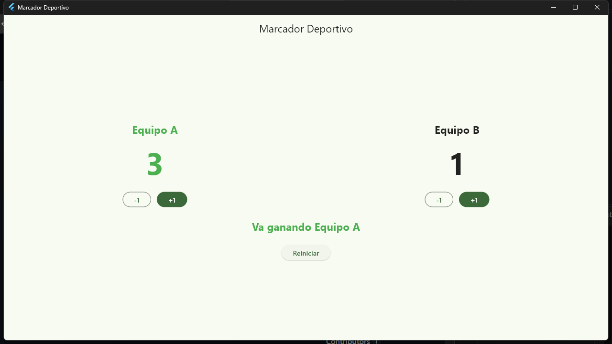
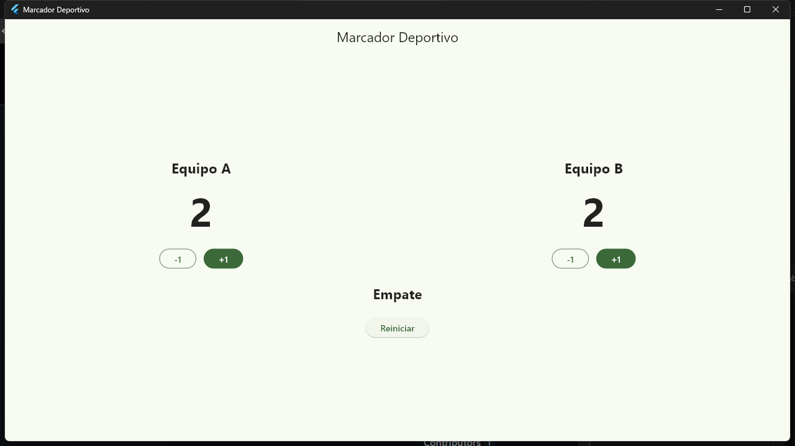

# Marcador Deportivo

Laboratorio de la Universidad Mesoamericana — Programación de Dispositivos Móviles.

Aplicación en **Flutter** con **Dart** que simula la pantalla de un marcador deportivo entre dos equipos (Equipo A y Equipo B). Ambos equipos inician con **0 puntos** y la interfaz se actualiza con `setState`.

## Requisitos cubiertos

- Pantalla **Scaffold** con **AppBar** de título "Marcador Deportivo".
- **Equipo A** y **Equipo B**, cada uno con su puntuación.
- Puntuación inicial de ambos equipos en **0**.
- Botones **+1** y **−1** para cada equipo.
- Ningún marcador puede bajar de **0**.
- Mensaje del resultado: **Empate**, **Va ganando Equipo A** o **Va ganando Equipo B**.
- Cambio de color dinámico: el equipo que va ganando se destaca en **verde**; en empate ambos vuelven al color neutro.
- Botón **Reiniciar** que restaura el estado completo (0 - 0, Empate, colores neutros).
- Estado local a través de un **StatefulWidget** y `setState`.
- Interfaz compuesta con widgets `Scaffold`, `AppBar`, `Column`, `Row`, `Text` y botones.

## Cómo ejecutar

```bash
flutter run
```

Puede ejecutarse en Windows (`-d windows`), navegador (`-d edge`) o cualquier dispositivo compatible.

## Capturas

**1. Un equipo ganando — Equipo A 3, Equipo B 1.** El equipo que va ganando se muestra en verde.



**2. Empate — Equipo A 2, Equipo B 2.** Ambos equipos en color neutro y el mensaje muestra "Empate".



## ¿Qué hace `setState`?

Cuando se presiona un botón (por ejemplo **+1**), el valor de la variable de estado (puntos) cambia dentro de `setState(() { ... })`. `setState` le avisa a Flutter que el estado cambió y que debe **rebuildear (reconstruir) el widget**, de modo que la interfaz se vuelve a dibujar con el nuevo valor y la puntuación se actualiza en pantalla.

Si se modificara el valor de los puntos **sin llamar a `setState`**, la variable interna sí tendría el nuevo número, pero Flutter no sabría que la pantalla debe volver a dibujarse. El resultado sería una interfaz desactualizada: la app guardaría el puntaje nuevo internamente mientras la pantalla seguiría mostrando el valor anterior, sin reflejar el cambio.

## Estructura del proyecto

```
marcador/
├── lib/
│   └── main.dart        # Código principal de la aplicación
├── test/
│   └── widget_test.dart # Pruebas básicas del marcador
├── capturas/
│   ├── captura_gana.png
│   └── captura_empate.png
├── android/
├── ios/
├── web/
├── windows/
└── pubspec.yaml
```